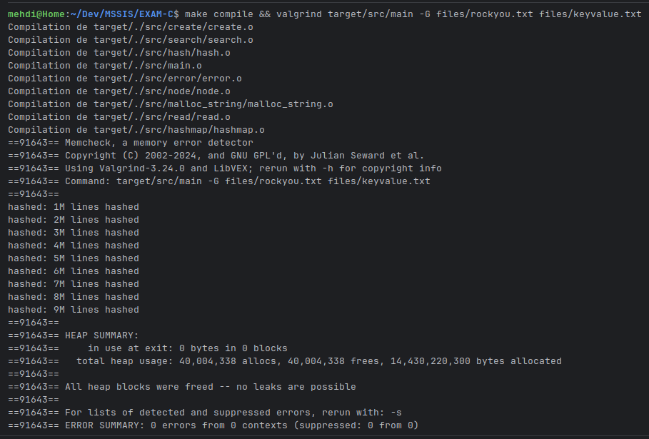
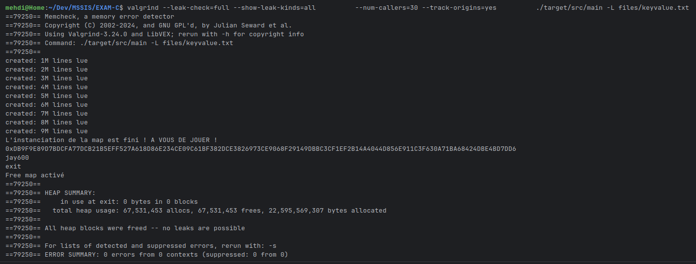

# Commandes
## Créer un container docker
```shell
# Build
sudo docker build -t mehdi_mascret_mssis .
# Lancer le container
sudo docker run --rm -it mehdi_mascret_mssis bash
# Si Valgrind est bloquer dans le container
sudo docker run --rm -it --ulimit nofile=1048576:1048576 mehdi_mascret_mssis bash
```
## Tester le logiciel
**A savoir** : 
- On ne peut pas avoir deux mode **(Load / Generate)** en même temps pour cette version de code !
- Pour quitter le mode Load, il faut taper "exit" une fois que vous pourrez taper des commandes

```shell
# Compiler d'abord et toujours le code ! Dans le container build pas besoin
make compile
# Lancer le mode Generate
./target/src/main -G files/rockyou.txt files/keyvalue.txt
# Penser à bien faire cette commande pour voir les hash histoire de ne pas tester sans avoir de hash en tete
cat files/keyvalue.txt | head -n 100
# Lancer le mode Load
./target/src/main -L files/keyvalue.txt

```
## Valgrind
Mon code se lance en moin de 10 secondes mais valgrind prend 1 minutes, ce qui est très inconfortable !
```shell
# Mode Generate
valgrind target/src/main -G files/rockyou.txt files/keyvalue.txt
# Mode Load
valgrind target/src/main -L files/keyvalue.txt
```
## Autre mode de hashage pour le mode generate
```shell
# Par défaut c'est l'algo 512
./target/src/main -G files/rockyou.txt files/keyvalue.txt -Algo SHA512
# Algo 256
./target/src/main -G files/rockyou.txt files/keyvalue.txt -Algo SHA256
```
## A savoir
Le programme ne retournera une erreur que si les paramètre 
donné ne sont pas conforme avec le mode utilisé, par example :

Le mode Load :
- N'a pas besoin des hash donc s'il y une erreur avec les hash elle ne sera pas marquer.
- N'a pas besoin d'output donc s'il est inexistant ou inaccessible, il ne renseignera pas d'erreur.

# Recherche
Dans un soucit de rapiditer pour le mode L (Load), j'ai implémenter un code qui tente de se rapprocher du code **Java pour les HashMap**

Vous trouverez la doc de mes recherches en [cliquant ici ](doc/search.md)
# Performance Valgrind
## Mode Generate

## Mode Load


